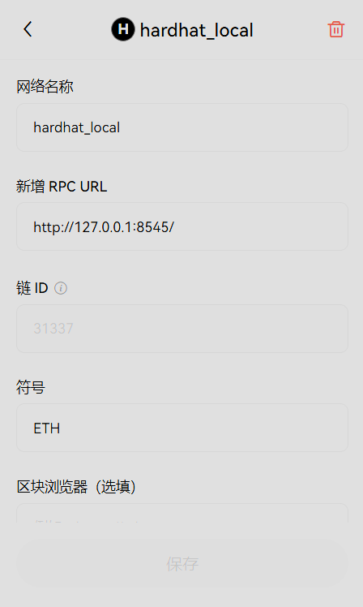

# 本地测试(https://hardhat.org/ignition/docs/getting-started#quick-start)
1. `npx hardhat node`启动本地测试网，可以看到启动在（http://127.0.0.1:8545/）和相关测试账号。
2. `npx hardhat ignition deploy ignition/modules/index.js --network localhost` 运行部署脚本，可以看到合约的地址，部署的账户默认是测试账号的第一个。
3. 在浏览器钱包中添加该本地网络（OKX为例）。

4. 根据测试需要，添加测试账户到浏览器钱包中。

# 已经部署合约地址：
1. zksync testnet
flareTokenContract was deployed to 0xdF8c5bB8F94D56555592C379C8a0c97051537a7B
proposalLogicContract was deployed to 0x7c056e2b92A3BCE893dAc106ADcC64C3fc11937F
2. sepolia testnet
FlareTokenModule#FlareToken - 0xBefF43B8AFF903D21293B229104f138FC9dF83Ce
ProposalLogicModule#ProposalLogic - 0xB6cBBbbF49664c749Fc519d7d03194C22645CC31


# 测试合约
1. `npx hardhat node`
2. `npx hardhat test --network hardhat`

# 部署ZkSync测试网步骤：
1. `npx  hardhat deploy-zksync --script index.js --network zkSyncTestnet`
2. 前往：https://sepolia.explorer.zksync.io/ 复制代币地址，查看合约
3. 验证（https://docs.zksync.io/build/tooling/hardhat/hardhat-zksync-verify.html#commands）
>（notes：如果要在浏览器上直接调用合约需要进行该步骤）

    1. 代币合约
        npx  hardhat verify --network zkSyncTestnet 代币地址
    2. 提案合约
        npx  hardhat verify --network zkSyncTestnet  合约地址  构造参数
# Sample Hardhat Project
This project demonstrates a basic Hardhat use case. It comes with a sample contract, a test for that contract, and a Hardhat Ignition module that deploys that contract.

Try running some of the following tasks:

```shell
npx hardhat help
npx hardhat test
REPORT_GAS=true npx hardhat test
npx hardhat node
npx hardhat ignition deploy ./ignition/modules/Lock.js
```
